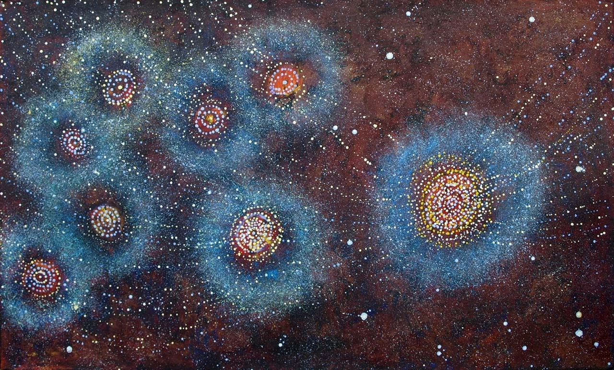

# Individual prototype for major assignment of IDEA9103
## How to interact
There is no need for any user input. You may just sit back and enjoy how the circles orbit around one and other and the stars float around. With each refresh, the position and color of the circle changes.
## Mechanism of my work
I have modified the group work with <b>Perlin noise and randomness</b></br>
### Animation
The size of the circles, the white dots in the background, and the colors of the circles are set to animate. Perlin noise has been used to create smoother animations. For example, if perlin noise has not been used for the color animation, the colors would keep flashing which breaks the tranquility of the rest of the work.</br>
### Originality
In addition to the gorup work, this sketch now looks more like the galaxy as the cirlces are in circular movement. This is well thought through, as the magnitude and direction of movement has a great impact for the big picture. Their movement is set in a circular route at different angles and speeds, morderated by perlin noise. </br>
To match the theme, the white dots in the background also danced in the same way. Their randomised alpha values also provided visual depth. The rotating 'dash rings' also gives the feeling of 'self rotating planets'.</br>
Moreover, with reference to the following images, a layer of dots was added to the background to model the star-studded galaxy. Most of dots are in a relatively dark color, with only some in a lighter tone to give a subtle feeling. </br>
```
let galaxyColors = [
      color (92, 78, 80), // dark red
      color (113, 88, 78), // dark orange
      color (27, 20, 14), // blue black
      color (61, 60, 69), // dark blue
      color (181, 156, 160), // light pink
      color (130, 125, 134), // light purple
    ]
```
The density of the dots are adjusted, so that the galaxy-dots fills the canvas, but the white dots, the brighter and larger stars, now rarer, will now stand out more than in the group work.
```
size: isGalaxy ? random(1.5, 3.5) : random(2.5, 5),
alpha: isGalaxy ? random(100, 200) : random(200, 255),
```
### Reference image
 </br>
Image 1 - Aboriginal art on the Galaxy </br>
### Technical explanation
The first step is to remove noLoop() since my work involves animation. This will prevent the sketch from being static.</br>
Some changes have been made to this code in order to make different components animate. The class Circles have been kept the same. Arrays for pulsing circles, moving background dots and animating colors have been added to the list of global variables. </br>
As the circles orbit and pulse, they require more space; hence, each row now only contains 3 circles instead of 5. Thus, the number of circles have decreased in order the accommodate the animation, while keeping the canvas clean. </br>
All techniques used come from the class. They include circular movement, involving sine and cosine. Push and pop is also used to keep certain format inside the brackets. Floor and modulus could round down numbers, and ensure the randomized number do not exceed the array length. For loops are used to create the dots in the background, and also to generate noise values. </br>
Claude was used as reference in the use of perlin noise, as it was a complicated procedure to incorporate noise in an already complex code.
